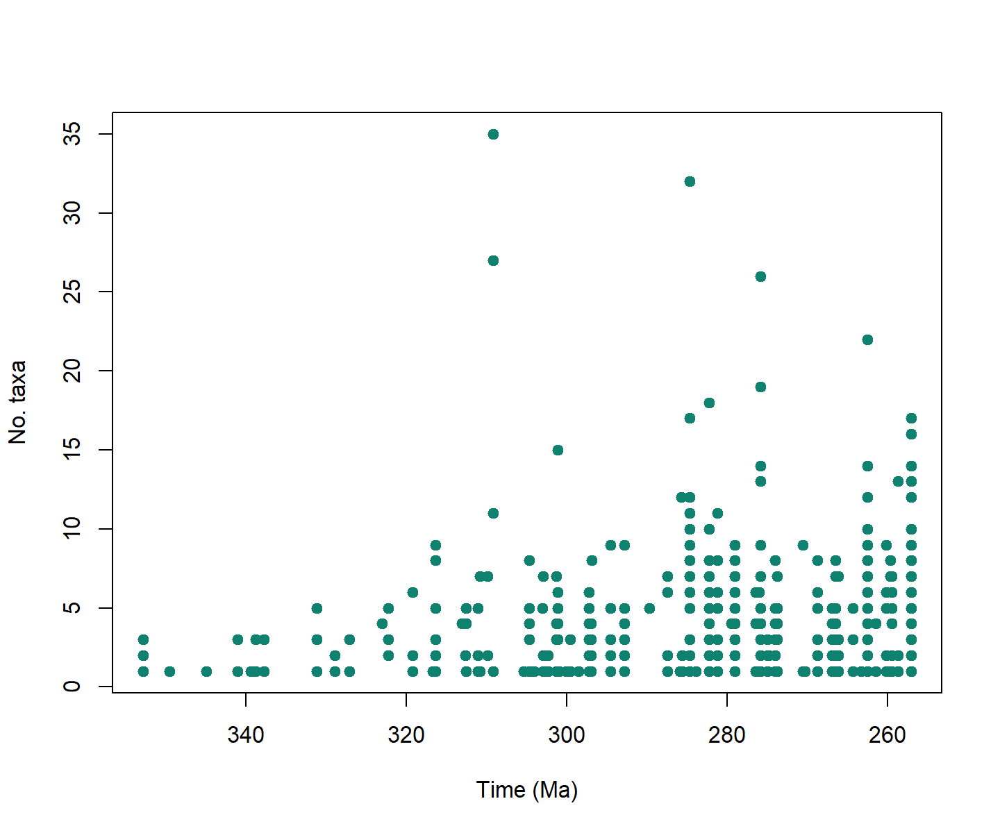
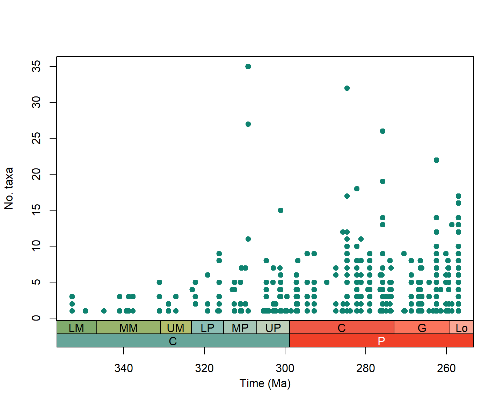
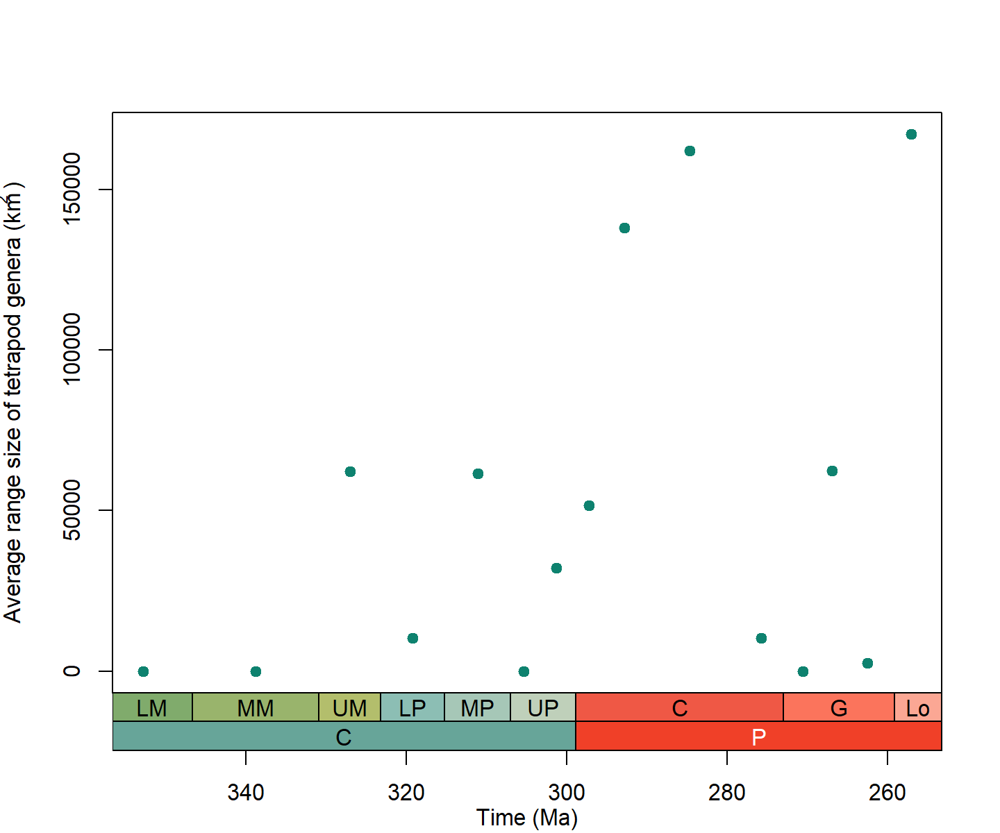

**Authors:** [The Palaeoverse Development Team](https://palaeoverse.org/#about-us)

**Last updated:** 2024-04-16


<div style="text-align: justify">

# Introduction

`palaeoverse` is an R package developed by palaeobiologists, for palaeobiologists. The aim of the package is to generate a community-driven toolkit of generic functions for the palaeobiological community. The package does not provide implementations of statistical analyses, rather it provides auxiliary functions to help streamline analyses and improve code readability and reproducibility. This vignette (or tutorial if you prefer) is provided to guide you through the installation process and some of the functionality available within `palaeoverse`. To do so, we will focus on a usage example looking at various trends in tetrapods across the Carboniferous/Permian boundary.

## Installation

The `palaeoverse` package can be installed via CRAN or its dedicated [GitHub repository](https://github.com/palaeoverse/palaeoverse) if the development version is preferred. To install via the CRAN, simply use:


```r
install.packages("palaeoverse")
```

To install the development version, first install the `devtools` package, and then use `install_github` to install `palaeoverse` directly from GitHub.


```r
install.packages("devtools")
devtools::install_github("palaeoverse/palaeoverse")
```

You can now load `palaeoverse` using the default `library` function:


```r
library(palaeoverse)
```

**Before we get onto the good stuff, the development team has a small request**. If you use `palaeoverse` in your research, please cite the associated publication. This will help us to continue our work in supporting you to do yours. You can access the appropriate citation via:


```r
citation("palaeoverse")
```

## Now that that's out of the way, let's begin!

The Carboniferous and early Permian have been regarded as critical intervals for early four-limbed vertebrates, in terms of both diversification and biogeography. During this time several major groups of tetrapods emerged (including crown amniotes), and the extensive tropical rainforests of the Carboniferous gave way to dryland vegetation during the Permian, in what's known as the 'Carboniferous Rainforest Collapse' (CRC) (for more information, see Dunne et al., 2018).

In this vignette we’ll use the `tetrapods` dataset to demonstrate how to use `palaeoverse` functions to examine how alpha diversity and range size vary across this interval.

# The Tetrapods Dataset

Functions in `palaeoverse` are designed around the assumption that most users' data are stored in an occurrence `data.frame`. As such, this is the expected input data format for most functions. We provide two example occurrence datasets (`tetrapods` and `reefs`) within the package from different data sources. While these two datasets have similar structures, the data (variables) available in each differ. The `tetrapods` dataset is a compilation of Carboniferous--Early Triassic tetrapod occurrences (*n* = 5,270) from the [Paleobiology Database](https://paleobiodb.org/#). We'll be using this dataset to demonstrate some of the available functionality in `palaeoverse`.

Let's get started by exploring the dataset.


```r
# Call the dataset:
data(tetrapods)

# View the column names and the first five lines of the first three columns:
colnames(tetrapods)
```

```
##  [1] "occurrence_no"     "collection_no"     "identified_name"   "identified_rank"  
##  [5] "accepted_name"     "accepted_rank"     "early_interval"    "late_interval"    
##  [9] "max_ma"            "min_ma"            "phylum"            "class"            
## [13] "order"             "family"            "genus"             "abund_value"      
## [17] "abund_unit"        "lng"               "lat"               "collection_name"  
## [21] "cc"                "formation"         "stratgroup"        "member"           
## [25] "zone"              "lithology1"        "environment"       "pres_mode"        
## [29] "taxon_environment" "motility"          "life_habit"        "diet"
```

```r
tetrapods[1:5, 1:3]
```

```
##   occurrence_no collection_no                        identified_name
## 1        146665         12943     n. gen. Anconastes n. sp. vesperus
## 2        147090         13004                     Gorgonopsia indet.
## 3        147521         13043 n. gen. Procolophon n. sp. trigoniceps
## 4        147523         13044       n. gen. Ophiodeirus n. sp. casei
## 5        147563         13046         Broiliellus n. sp. arroyoensis
```

As you can see, we have a variety of variables to play around with! For this vignette we'll mostly be focusing on some of the spatial information, such as latitude and longitude. But first, we need to do some data prep...

# Exploring the functions

If we're looking at patterns of tetrapod diversity and distribution over the Carboniferous and Permian, we'll first have to bin our occurrences by time and by space. We can do this easily with a few functions in the `palaeoverse` package. Let's first look at binning by time.

There are two `palaeoverse` functions that help us to assign occurrences to different intervals, or 'bins', of time. First, we'll use `time_bins` to make some suitable time bins for our study. The function requires a maximum and a minimum time interval to run. As we know we're interested in looking at the Carboniferous and the Permian, we can use these as our intervals to get the suitable stage-level bins that we're after:


```r
# Generate time bins
bins <- time_bins(interval = c("Carboniferous", "Permian"),
                  rank = "stage",
                  scale = "GTS2012",
                  plot = FALSE)

head(bins)
```

```
##   bin interval_name  rank max_ma mid_ma min_ma duration_myr abbr  colour  font
## 1   1   Tournaisian stage  358.9 352.80  346.7         12.2    T #8CB06C black
## 2   2        Visean stage  346.7 338.80  330.9         15.8    V #A6B96C black
## 3   3  Serpukhovian stage  330.9 327.05  323.2          7.7   Se #BFC26B black
## 4   4    Bashkirian stage  323.2 319.20  315.2          8.0    B #99C2B5 black
## 5   5     Moscovian stage  315.2 311.10  307.0          8.2    M #B3CBB9 black
## 6   6    Kasimovian stage  307.0 305.35  303.7          3.3   Ka #BFD0C5 black
```
Before we can bin our occurrences into these time bins, we will need the ages of the occurrences in millions of years. Since the numeric ages may have changed since we downloaded the data from the PBDB, we'll use `look_up` to get the numeric ages for the occurrences within `tetrapods` dataset based on their assigned interval names:


```r
# Get new numeric ages for named intervals using the interval key that is supplied with Palaeoverse
tetrapods <- look_up(tetrapods, int_key = interval_key)

# Make sure that any values which could not be matched contain their original values
tetrapods$interval_max_ma <- ifelse(is.na(tetrapods$interval_max_ma),
                                    tetrapods$max_ma,
                                    tetrapods$interval_max_ma)
tetrapods$interval_min_ma <- ifelse(is.na(tetrapods$interval_min_ma),
                                    tetrapods$min_ma,
                                    tetrapods$interval_min_ma)
tetrapods$interval_mid_ma <- (tetrapods$min_ma + tetrapods$max_ma)/2

# Look at the updated dataset
tetrapods[1:5, 35:37]
```

```
##   interval_max_ma interval_mid_ma interval_min_ma
## 1         307.000         302.400          298.90
## 2         265.100         262.500          259.10
## 3         251.902         249.685          247.20
## 4         290.100         284.700          283.50
## 5         283.500         275.800          272.95
```
As you can see we've got some new columns with updated interval ages. Handy!

Now we're ready to bin the occurrences into these time bins using `bin_time`. For now, we'll go with the 'mid' method, but we'll talk about this more in a minute.


```r
# Rename columns so that new intervals are used for binning
colnames(tetrapods)[9:10] <- c("old_max_ma", "old_min_ma")
colnames(tetrapods)[c(35, 37)] <- c("max_ma", "min_ma")

# Generate time bins
tetrapods <- bin_time(occdf = tetrapods,
                      bins = bins,
                      method = 'mid')
```

```
## Error in bin_time(occdf = tetrapods, bins = bins, method = "mid"): Minimum age of occurrence data is less than minimum age of bins.
```

Oh no! We've hit an error. This is because there's some occurrences that sit outside of the time intervals we're interested in. `bin_time` can't bin occurrences which sit outside of the time intervals you've chosen, so for it to work, we'll first have to remove these occurrences.


```r
# Remove occurrences that are younger than the time intervals we're interested in
cp_tetrapods <- subset(tetrapods, min_ma > min(bins$min_ma))

# Bin occurrences into chosen time bins
mid_tetrapods <- bin_time(occdf = cp_tetrapods,
                          bins = bins,
                          method = 'mid')
```

```
## Warning in bin_time(occdf = cp_tetrapods, bins = bins, method = "mid"): One or more
## occurrences have a midpoint age equivalent to a bin boundary. Binning skipped for these
## occurrences. Hint: `which(is.na(occdf$bin_assignment))`.
```

That's better! Let's see how our dataset has changed.


```r
# Examine the dataset columns
colnames(mid_tetrapods)
```

```
##  [1] "occurrence_no"     "collection_no"     "identified_name"   "identified_rank"  
##  [5] "accepted_name"     "accepted_rank"     "early_interval"    "late_interval"    
##  [9] "old_max_ma"        "old_min_ma"        "phylum"            "class"            
## [13] "order"             "family"            "genus"             "abund_value"      
## [17] "abund_unit"        "lng"               "lat"               "collection_name"  
## [21] "cc"                "formation"         "stratgroup"        "member"           
## [25] "zone"              "lithology1"        "environment"       "pres_mode"        
## [29] "taxon_environment" "motility"          "life_habit"        "diet"             
## [33] "early_stage"       "late_stage"        "max_ma"            "interval_mid_ma"  
## [37] "min_ma"            "id"                "n_bins"            "bin_assignment"   
## [41] "bin_midpoint"
```

As you can see, four new columns (variables) have been added to our dataset. Two of these are especially important. First is the `bin_assignment`, which shows which number bin the occurrence has been added to. Second is `n_bins` - this shows how many bins the occurrence could potentially have been placed within. Let's examine this further.


```r
# Make a table of potential number of bins
table(mid_tetrapods$n_bins) # raw counts
```

```
## 
##    1    2    3    4    5    6    7    8    9 
##  843 1754  425  268   33   34    3    2   16
```

```r
table(mid_tetrapods$n_bins) / nrow(mid_tetrapods) # proportions
```

```
## 
##            1            2            3            4            5            6            7 
## 0.2495559503 0.5192421551 0.1258140912 0.0793368857 0.0097690941 0.0100651273 0.0008880995 
##            8            9 
## 0.0005920663 0.0047365305
```

As you can see, only ~25% of the dataset can be assigned to just one bin - the other occurrences can't be confidently assigned to an individual time interval. This is where the other methods for the `bin_time` function come in handy. They provide the user with different options when assigning occurrences to bins. Instead of the 'mid' method, let's try the 'majority' method instead, which places the occurrences in the bin which covers the majority of their potential time range.


```r
# Bin occurrences into chosen time bins
maj_tetrapods <- bin_time(occdf = cp_tetrapods,
                          bins = bins,
                          method = 'majority')
```

We'd recommend playing around with these different options and seeing how they impact your results!

Next, we'll also bin our occurrences spatially. We need a couple of functions to do this. Firstly, we need to add palaeocoordinates to our dataset. We can use the `palaeorotate` function to do this.


```r
# Palaeorotate occurrences
maj_tetrapods <- palaeorotate(occdf = maj_tetrapods, age = "bin_midpoint",
                              method = "point", model = "PALEOMAP")
```

Now let's check that it's worked...


```r
# Check palaeocoordinates
head(maj_tetrapods[, c("p_lng", "p_lat")])
```

```
##      p_lng    p_lat
## 1 -39.1618   2.9214
## 2 -34.0923 -59.1326
## 4 -29.7188  -0.1250
## 5 -27.9228   3.6845
## 6 -29.0469  -0.2730
## 7 -16.5579  -6.0513
```

Looks good to me! Now that we have palaeocoordinates for our occurrences, we can put them into spatial bins. We can do this using the `bin_space` function, which assigns each occurrence to one of many discrete equal-area hexagonal grid cells (based on [Uber's H3 system](https://h3geo.org/)).


```r
# Make a table of potential number of bins
maj_tetrapods <- bin_space(occdf = maj_tetrapods,
                           lng = 'p_lng',
                           lat = 'p_lat',
                           spacing = 100)
```

```
## Average spacing between adjacent cells in the primary grid was set to 103.6 km. 
## H3 resolution: 3
```

```r
# Show the first 6 rows of the new columns added using `bin_space`.
head(maj_tetrapods[, c("cell_ID", "cell_centroid_lng", "cell_centroid_lat")])
```

```
##           cell_ID cell_centroid_lng cell_centroid_lat
## 1 8380d4fffffffff         -38.83199        3.04111345
## 2 83dd68fffffffff         -34.66666      -59.09848198
## 4 837c65fffffffff         -29.87643       -0.04859754
## 5 837c40fffffffff         -27.94272        3.31086571
## 6 837c64fffffffff         -28.90531       -0.63974717
## 7 837da3fffffffff         -16.16673       -6.15422544
```
`bin_space` adds some new columns, including one with the unique grid cell ID, as well as latitudinal and longitudinal coordinates for the centroid of that cell.

Now that we have both temporal and spatial bins, we can use these data to see how the spatial coverage of tetrapod fossils in our dataset varies through time.


```r
# Extract unique interval midpoints
midpoints <- sort(unique(maj_tetrapods$bin_midpoint))

# Calculate the number of unique cells in each time bin
unique_cells <- unique(maj_tetrapods[, c("bin_midpoint", "cell_ID")])
spat.cov <- group_apply(unique_cells, group = "bin_midpoint", fun = nrow)
```
Let's save that for now and move on to some of our analyses!

# Unique taxa and alpha diversity

In many cases palaeobiologists count unique taxa by retaining only unique occurrences identified to a given taxonomic resolution (e.g. genera or species); however, this can result in some useful information being discarded. The `tax_unique` function retains occurrences identified to a coarser taxonomic resolution which are not already represented within the dataset. Take, for example, the following occurrences:

- *Albertosaurus sarcophagus*
- *Ankylosaurus* sp.
- *Ceratopsidae* indet.
- *Ornithominus* sp.
- *Tyrannosaurus rex*

A filter for species-level identifications would reduce the species richness to just two (*A. sarcophagus* and *T. rex*). However, none of these clades are nested within one another, so each of the indeterminately identified occurrences represents at least one species not already represented in the dataset. `tax_unique` is designed to deal with such taxonomic data and would retain all seven 'species' in this example. For further details see `?tax_unique`.

This function can be especially useful for when looking at alpha diversity (local richness). Let's apply it to our dataset by filtering it to genus-level.


```r
# Filter to genus-level:
tet_genera <- tax_unique(occdf = maj_tetrapods, genus = "genus", family = "family",
                         order = "order", class = "class", resolution = "genus")
```

We can compare this to the genera from the original dataset to see how many genera were added by using `tax_unique()`:


```r
# How many unique genera before:
length(unique(maj_tetrapods$genus))
```

```
## [1] 717
```

```r
# How many unique genera after:
length(unique(tet_genera$unique_name))
```

```
## [1] 719
```

As you can see we've added two taxa that otherwise would have been ignored! To see more specifically how the function has performed, take a look at row 718, which records an indeterminate occurrence of the family *Dicynodontidae*. This occurrence now has a unique name of 'Dicynodontidae indet.'


```r
# See just row 718
tet_genera[718, ]
```

```
##            class        order         family genus           unique_name
## 718 Osteichthyes Dicynodontia Dicynodontidae  <NA> Dicynodontidae indet.
```

Now, let's use this function to extract the unique genera for each collection (=locality) with `group_apply`:


```r
# Use group_apply along with tax_unique:
coll_genera <- group_apply(occdf = maj_tetrapods,
                           group = c("collection_no"),
                           fun = tax_unique,
                           genus = "genus",
                           family = "family",
                           order = "order",
                           class = "class",
                           resolution = "genus")

# See structure of the new dataframe:
str(coll_genera)
```

```
## 'data.frame':	2853 obs. of  6 variables:
##  $ class        : chr  "Osteichthyes" "Osteichthyes" "Osteichthyes" "Reptilia" ...
##  $ order        : chr  NA "Temnospondyli" "Cotylosauria" NA ...
##  $ family       : chr  NA "Dissorophidae" NA "Bolosauridae" ...
##  $ genus        : chr  NA "Parioxys" "Archeria" "Bolosaurus" ...
##  $ unique_name  : chr  "Osteichthyes indet." "Parioxys sp." "Archeria sp." "Bolosaurus sp." ...
##  $ collection_no: chr  "11149" "11152" "11165" "11165" ...
```

Next, let's count the number of unique genera per collection:


```r
# Get the names of unique genera per collection
unique_genera <- unique(coll_genera[, c("unique_name", "collection_no")])

# Calculate the number of unique genera per collection
coll_taxa <- group_apply(unique_genera, group = "collection_no", fun = nrow)

# Rename column names:
colnames(coll_taxa) <- c("n_taxa", "collection_no")

# Take a quick look at the new dataframe
head(coll_taxa)
```

```
##   n_taxa collection_no
## 1      1        104796
## 2      1        106270
## 3      3        106558
## 4      8        108766
## 5      3        109702
## 6      1         11149
```

To plot an alpha diversity (local richness) plot, we will need to add interval age data to these collections:


```r
# Take the columns pertaining to collections and their ages in millions of years:
coll_info <- maj_tetrapods[, c("collection_no", "max_ma", "interval_mid_ma", "min_ma")]

# Remove duplicated collections based on the collection number (column 1)
coll_info <- coll_info[!duplicated(coll_info[1]),]

# Combine this dataframe with the dataframe from above
alpha_data <- merge(coll_info, coll_taxa, by = "collection_no")

# Take a look:
head(alpha_data)
```

```
##   collection_no max_ma interval_mid_ma min_ma n_taxa
## 1         11149 290.10          284.70 283.50      1
## 2         11152 293.52          283.90 272.95      1
## 3         11165 298.90          294.50 290.10      9
## 4         11323 303.70          301.15 293.52      1
## 5         12943 307.00          302.40 298.90      1
## 6         12976 283.50          275.80 272.95      7
```

Done. Now to plot alpha diversity through time! Let's start with a simple scatterplot:


```r
# Make a plot for alpha diversity in the Carboniferous and Permian
plot(alpha_data$interval_mid_ma, alpha_data$n_taxa, # add the points
     xlim = rev(range(alpha_data$interval_mid_ma, na.rm = TRUE)), # reverse the x-axis
     xlab="Time (Ma)", ylab="No. taxa", # axes labels
     pch = 19, col = "#0e826f") # point style and colour
```

<div class="figure">

<p class="caption">plot of chunk alpha-div-plot-1</p>
</div>

That looks good, but it's a bit difficult to figure out what stages contain which data points. `axis_geo()` adds a geological timescale between the plot and the axis.

Taking our plot from above, let's use this function to add a timescale to the x-axis:


```r
# Set margins
par(mar = c(7.1, 4.1, 4.1, 2.1)) # expand at bottom if adding more interval categories

# Make the final alpha diversity plot
plot(alpha_data$interval_mid_ma, alpha_data$n_taxa, # add the points
     axes = FALSE,
     xlim = rev(range(alpha_data$interval_mid_ma, na.rm = TRUE)), # reverse the x-axis
     xlab = " ", ylab = "No. taxa", # axes labels
     pch = 19, col = "#0e826f") # point style and colour
box()
axis(2) # add a normal axis to the elft side
axis_geo(side = 1, intervals = list("epochs", "periods"))
title(xlab = "Time (Ma)", line = 4)
```

<div class="figure">

<p class="caption">plot of chunk alpha-div-plot-2</p>
</div>

Amazing! Now we can clearly see that alpha diversity appears to be a lot higher in the Permian than the Carboniferous. But how has the spatial distribution of tetrapods changed across this boundary? Let's use some of the other `palaeoverse` functions to find out!

# Exploring range size/spatial issues through time

Another factor that we can examine is how range size of taxa changed across the C/P boundary. We can examine this spatial distribution through time using the `tax_range_space` function, which provides several different methods for estimating the distribution of taxonomic occurrences. For now we'll use the method `con` which calculates the geographic range of taxa using a convex hull, but the rest of the methods are described in detail in the function documentation which can be accessed via `?tax_range_space`.

We can use this in combination with `group_apply` to calculate the average for each time interval for our dataset:


```r
# First, remove any occurrences without a genus
space_tetrapods <- subset(maj_tetrapods, !is.na(genus))

# Find temporal range of all genera
space_tetrapods <- group_apply(occdf = space_tetrapods,
                               group = c("bin_midpoint"),
                               fun = tax_range_space,
                               name = "genus",
                               lng = "p_lng",
                               lat = "p_lat",
                               method = "con")

# Have a look at the dataset
head(space_tetrapods)
```

```
##               taxon taxon_id      area bin_midpoint
## 1         Abdalodon        1      0.00       257.05
## 2         Acrodenta        2      0.00       257.05
## 3       Adelosaurus        3      0.00       257.05
## 4     Aelurognathus        4 292392.77       257.05
## 9      Aelurosaurus        5  14698.41       257.05
## 14 Aenigmastropheus        6      0.00       257.05
```
As you can see, the combination of `group_apply` and `tax_range_space` produces a dataset with the area of geographic range for each taxon in kilometers squared for each time interval. Note that an area of zero here means that there is only one occurrence of that taxon in that time bin. From this information we can now plot how the average range size of tetrapods changed throughout the Carboniferous and Permian:


```r
# Find the average geographic range size for each time interval
space_tetrapods_mean <- group_apply(space_tetrapods, "bin_midpoint", function(df) mean(df$area))
colnames(space_tetrapods_mean) <- c("mean_area", "bin_midpoint")

# Create a plot of average range size through time
plot(space_tetrapods_mean$bin_midpoint, space_tetrapods_mean$mean_area, # add the points
     axes = FALSE,
     xlim = rev(range(as.numeric(space_tetrapods_mean$bin_midpoint), na.rm = TRUE)), # reverse the x-axis
     xlab = " ", ylab = expression("Average range size of tetrapod genera (km"^2~")"), # axes labels
     pch = 19, col = "#0e826f") # point style and colour
box()
axis(2) # add a normal axis to the left side
axis_geo(side = 1, intervals = list("epochs", "periods"))
title(xlab = "Time (Ma)", line = 4)
```

<div class="figure">

<p class="caption">plot of chunk alpha-div-plot-3</p>
</div>

From this plot it seems like the average geographic range size of tetrapods increased during the Permian. However, we first need to be sure we're not picking up on another pattern. Remember how we calculated the number of unique geographic cells in each time interval earlier? This provides a measure of the spatial spread of the fossil record. It might be that we're not picking up on an increased range size but just a larger geographic spread of fossil bearing rocks within the Permian. To see if this is the case, we can run a simple correlation test between the average geographic range size of tetrapods and the number of unique grid cells in each time interval:


```r
# Run a correlation test between mean range size and the spatial spread of cells
# through time
cor.test(log10(space_tetrapods_mean$mean_area), log10(spat.cov$nrow), method = "spearman")
```

```
## 
## 	Spearman's rank correlation rho
## 
## data:  log10(space_tetrapods_mean$mean_area) and log10(spat.cov$nrow)
## S = 226.12, p-value = 0.01898
## alternative hypothesis: true rho is not equal to 0
## sample estimates:
##       rho 
## 0.5962179
```
The high rho value and a p-value less than our cut off for significance (0.05) indicate a strong and statistically significant correlation between average geographic range size and the spatial spread of data. Seems like this work is far from over...

...but we'll leave the rest to you!

Hopefully this vignette has shown you the potential uses for `palaeoverse` functions and helped provide a workflow for your own analyses. If you have any questions about the package or its functionality, please feel free to join our [Palaeoverse Google group](https://groups.google.com/g/palaeoverse) and leave a question; we'll aim to answer it as soon as possible!

# References

Dunne, E.M., Close, R.A., Button, D.J., Brocklehurst, N., Cashmore, D.D., Lloyd, G.T. and Butler, R.J., 2018. Diversity change during the rise of tetrapods and the impact of the ‘Carboniferous rainforest collapse’. Proceedings of the Royal Society B: Biological Sciences, 285(1872), 20172730.

</div>

<style type="text/css">
p.caption {
  display: none;
}
</style>
